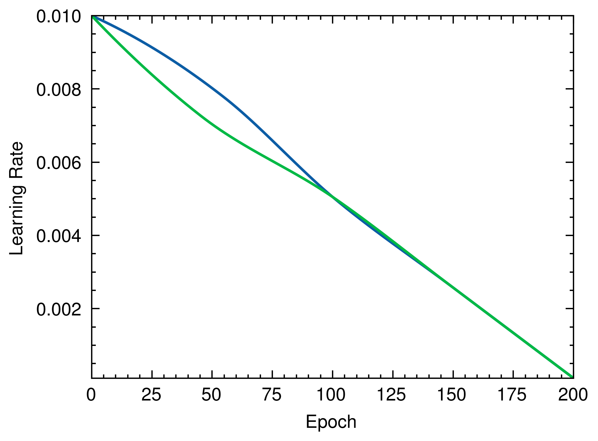

# Cubic Hermite Spline-based Learning Rate Scheduler

This project implements a concept for a Learning Rate Scheduler using Cubic Hermite Splines.
The scheduler provides a smooth transition between initial and final learning rates over the course of training epochs.

## Overview

The main components of this project are:

1. A `SplineLR` struct that defines the learning rate scheduler.
2. Functions to generate control points for the splines.
3. Code to create and evaluate Cubic Hermite Splines.
4. Visualization of the generated learning rate curves.

## Dependencies

This project uses the following dependencies:

- `peroxide`: For mathematical operations and plotting. (for plot feature, we need two python libraries: matplotlib & scienceplots)

## Key Features

- Customizable initial and minimum learning rates.
- Adjustable number of epochs.
- Generation of both "plus" and "minus" spline curves.
- Logarithmic scaling of learning rates for better visualization.
- Output of high-quality plots (600 DPI) in PNG format.

## Usage

To run the code:

1. Ensure you have Rust and the required dependencies installed.
2. Clone this repository.
3. Run the code using `cargo run`.

The program will generate three PNG images (`spline1.png`, `spline2.png`, `spline3.png`) showing different variations of the learning rate curves.

## Visualization

The code generates three plots, each showing two variations of the learning rate curve:

1. `spline1.png`: Adjustment at the first control point.
2. `spline2.png`: Adjustment at the second control point.
3. `spline3.png`: Adjustment at the third control point.

Each plot displays:

- The x-axis representing the training epochs.
- The y-axis (in logarithmic scale) representing the learning rate.
- Two curves: one for the "plus" variation and one for the "minus" variation.

## Implementation Details

- The `SplineLR` struct holds the initial parameters: initial learning rate, minimum learning rate, and total number of epochs.
- The `delta_pt` method calculates the displacement of control points.
- The `gen_pts` method generates the control points for the splines.
- The `gen_splines` method creates the Cubic Hermite Splines using the generated control points.
- The main function sets up the parameters, generates the splines, and creates the visualizations.

## Contributing

Contributions to improve or extend this concept are welcome. Please feel free to submit issues or pull requests.

## License

This project is licensed under the MIT License. See the [LICENSE](./LICENSE) file for details.
